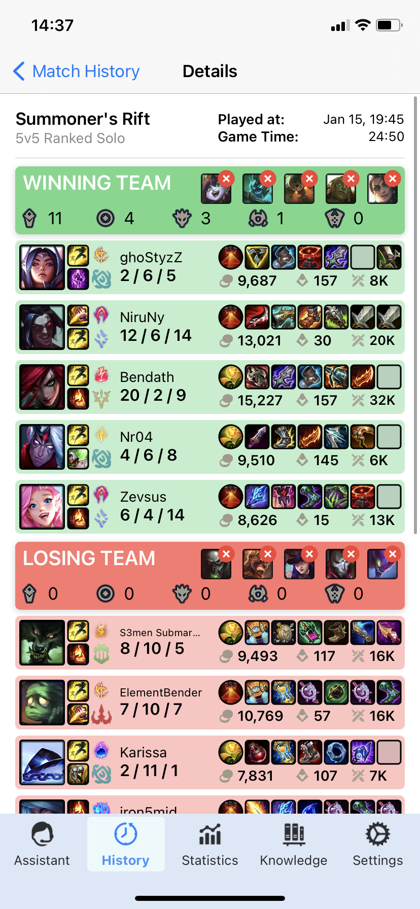
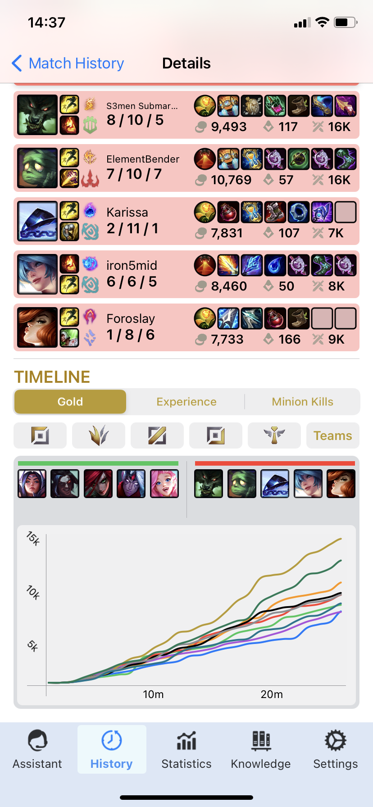
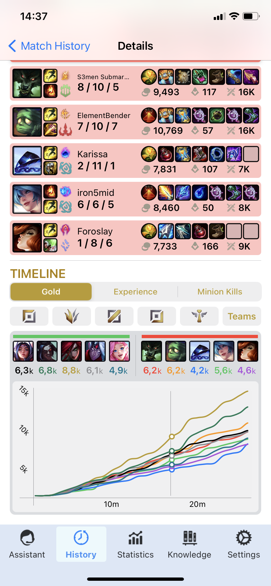
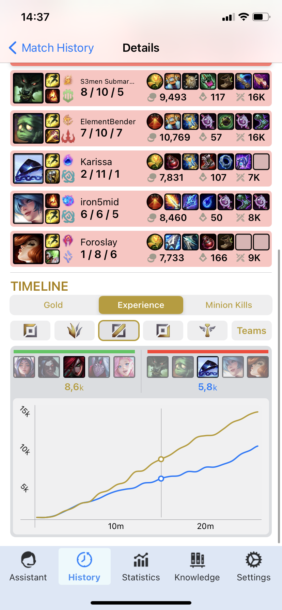

# Legend_Within
Smart League of Legends game pre and post analysis app. (Work in Progress)

Mainly displays knowledge of Combine, SwiftUI and Moya+WebAPIs in general.

Screenshots:

<table>
  <tr>
    <td>
      
    </td>
    <td>
      
    </td>
    <td>
      
    </td>
  </tr>
  <tr>
    <td>
      
    </td>
    <td>
      
    </td>
    <td>
    </td>
  </tr>
  </table>
