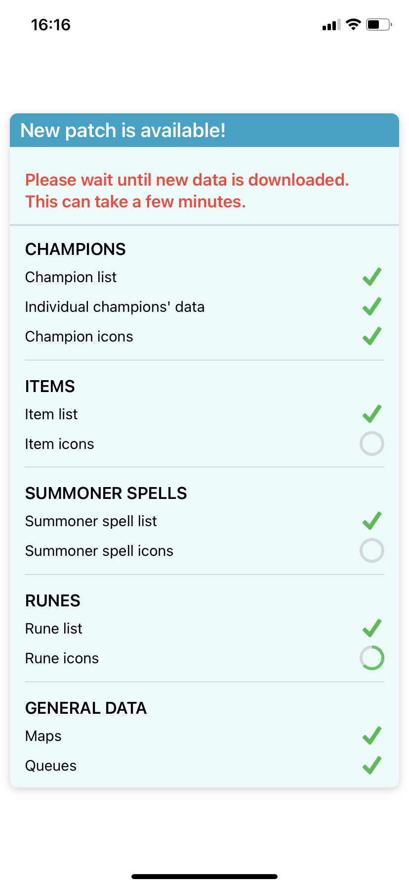
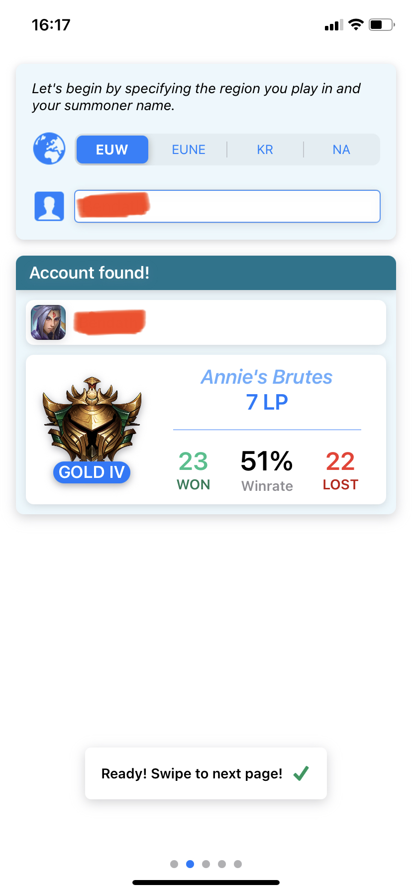
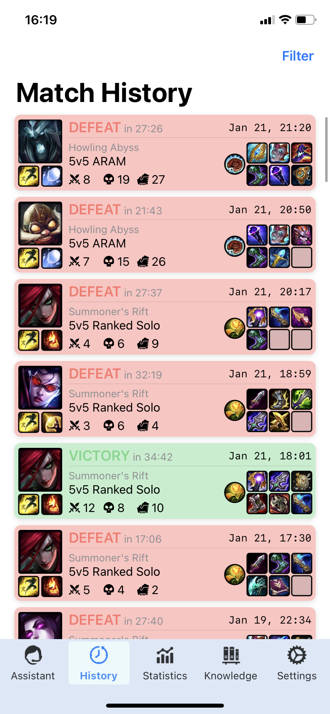
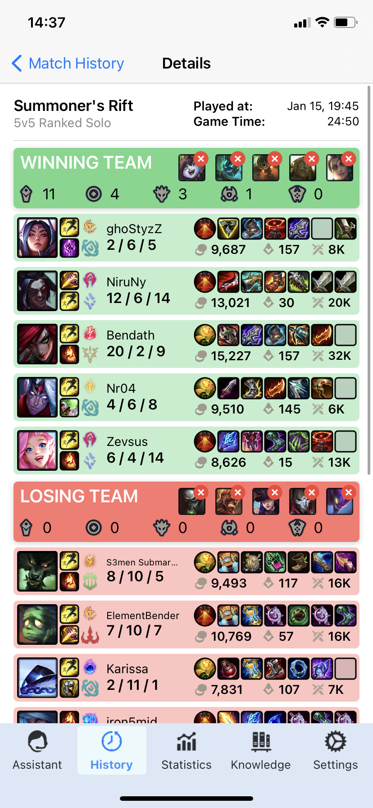
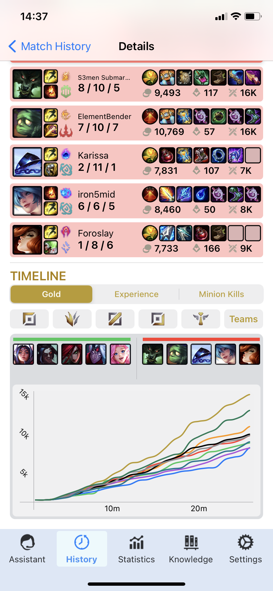
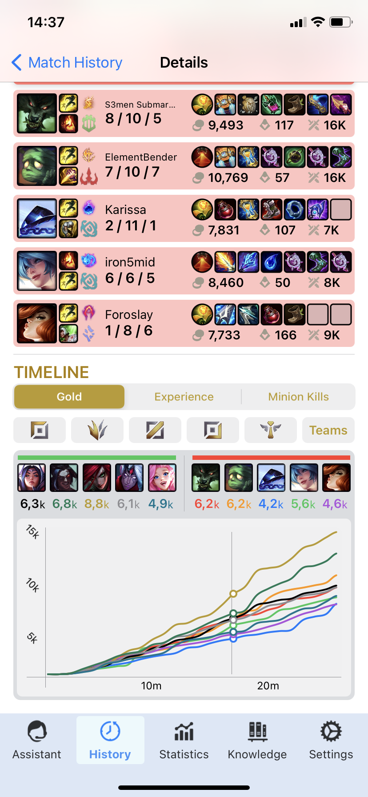
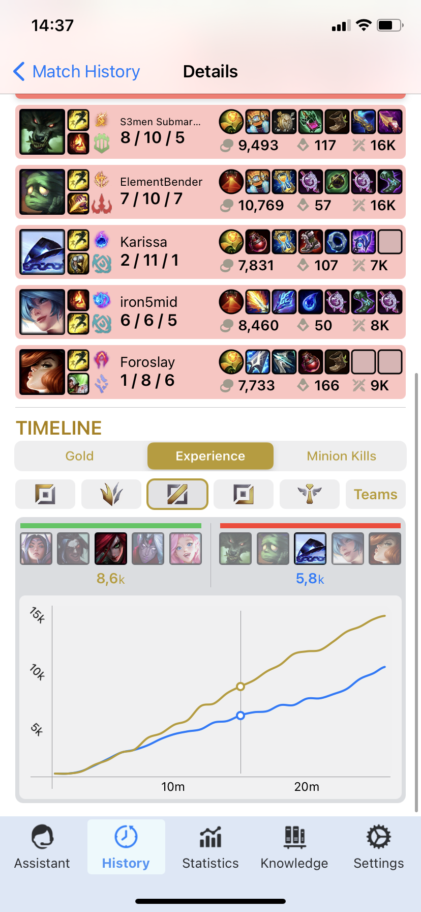

<h1>Legend_Within</h1>
<h3>Smart League of Legends game pre and post analysis app. (Work in Progress)</h3>

Mainly displays knowledge of Combine, SwiftUI and Moya+WebAPIs in general.
As an extra, <i>the project uses a machine learning model with CoreML to determine player lane positions</i> (top/mid/bottom or jungle).

Screenshots:

<table>
  <tr>
    <td width="250">
      <h4>Patch check on every start</h4>
      
    </td>
    <td width="250">
      <h4>Summoner search</h4>
      
    </td>
    <td width="250">
      <h4>UI Sample (just concept)</h4>
      
    </td>
  </tr>
  <tr>
    <td>
      <h4>Match History</h4>
      
    </td>
    <td>
      <h4>End game statistics</h4>
      
    </td>
    <td>
      <h4>Chart - default view</h4>
      
    </td>
  </tr>
  <tr>
    <td>
      <h4>Chart - number check</h4>
      
    </td>
    <td>
      <h4>Chart - filtering</h4>
      
    </td>
    <td>
    </td>
  </tr>
  </table>
